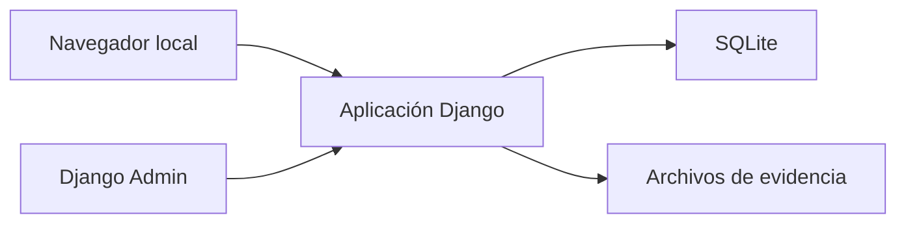
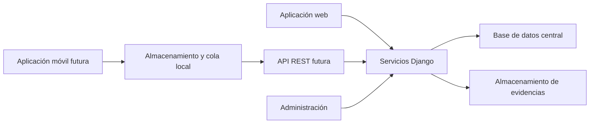

# Arquitectura propuesta

## Estado actual

El MVP web es una aplicación monolítica local. Django procesa autenticación,
formularios, permisos, reglas de negocio, vistas, archivos y persistencia.

GitHub Pages publica de manera independiente archivos HTML, CSS, JavaScript y
SVG. El mockup no se comunica con Django.

## Evolución propuesta

## Responsabilidades

| Componente | Responsabilidad |
|---|---|
| Aplicación móvil | Captura rápida, borradores locales y consulta breve |
| Cola local | Conservar operaciones pendientes y reintentos |
| API futura | Contrato autenticado, validación e idempotencia |
| Django | Reglas de negocio, permisos, catálogos e históricos |
| Base central | Estado confirmado de los registros |
| Almacenamiento | Evidencias asociadas y controles de integridad |
| Aplicación web | Administración, supervisión y consulta completa |

## Decisiones de continuidad

- Conservar el dominio y las validaciones del MVP como fuente de verdad.
- Usar los UUID existentes para transportar identidad entre canales.
- No permitir que el cliente móvil omita reglas del servidor.
- Separar captura local, sincronización y confirmación del servidor.
- Tratar fotografías como recursos asociados con confirmación propia.
- Diseñar la API antes de construir una aplicación nativa.

## Seguridad propuesta

- HTTPS obligatorio.
- Autenticación con sesiones o tokens de corta duración.
- Autorización evaluada en cada operación.
- Validación de contenido y límites de tamaño en servidor.
- Registro de eventos sin contraseñas ni contenido sensible innecesario.
- Separación de configuraciones por entorno.

## Aspectos aún no decididos

La tecnología móvil, el motor de base central, el sistema definitivo de archivos
y la estrategia de despliegue requieren una evaluación posterior. Elegirlos en
esta etapa no es necesario para demostrar el flujo ni la integración propuesta.
