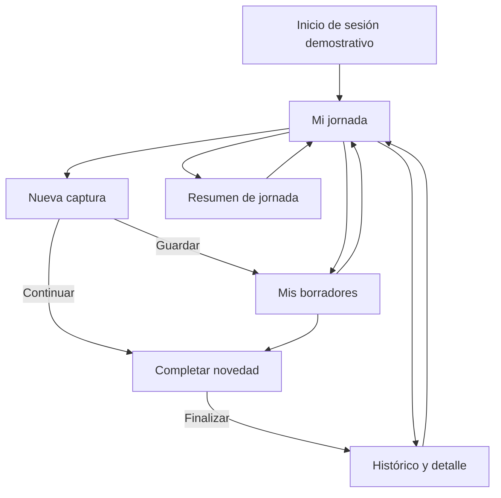

# Flujo de navegación del prototipo

## Diagrama principal

## Comportamiento representado

1. El login acepta valores ficticios y no realiza autenticación.
2. **Mi jornada** concentra indicadores y accesos.
3. **Nueva captura** valida que exista texto o una fotografía seleccionada.
4. Al simular falta de cobertura, el guardado informa estado local pendiente.
5. **Mis borradores** permite filtrar y continuar registros.
6. **Completar novedad** exige título, descripción, disciplina, tipo, turno y
   prioridad antes de simular la finalización.
7. **Resumen de jornada** exige redacción manual; no genera contenido.
8. **Histórico** permite filtrar y seleccionar un detalle ficticio.

La barra inferior facilita el regreso a Jornada, Captura, Borradores e
Histórico. Los encabezados contienen botones de retorno para preservar un flujo
comprensible en pantallas pequeñas.
