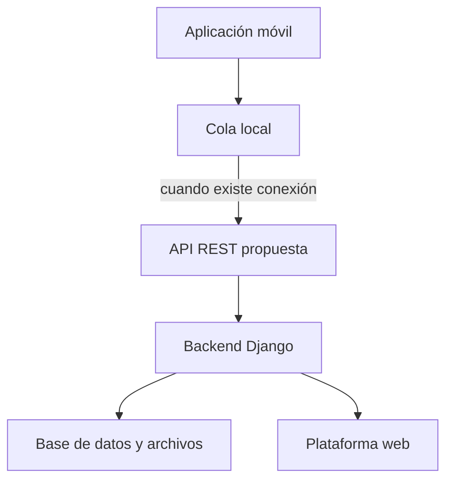

# Propuesta de integración móvil/web

## Propósito

Esta propuesta extiende de forma gradual el dominio ya implementado por
BitaTurno. No describe una API existente ni una sincronización operativa: define
la arquitectura que podría conectar una futura aplicación móvil con el MVP web.

## Aplicación móvil propuesta

La aplicación móvil se orientaría a la captura y consulta rápida durante una
jornada:

- texto y una o más evidencias según el alcance futuro;
- borradores con almacenamiento local;
- fecha de ocurrencia;
- clasificación inmediata o posterior;
- consulta breve de novedades;
- estado de sincronización;
- resumen manual de jornada.

## Plataforma web implementada

El MVP Django ya proporciona:

- autenticación y gestión de usuarios;
- administración de disciplinas, tipos, turnos, áreas y equipos;
- creación y finalización de novedades;
- borradores;
- fotografía opcional;
- histórico, filtros y detalle;
- estados operacionales y fechas;
- permisos y trazabilidad básica del autor.

## Componentes comunes

Ambos canales compartirían los conceptos de usuario, disciplina, tipo de
novedad, turno, área, equipo, prioridad, novedad, evidencia, estado y fechas.
Los identificadores UUID portables existentes permiten mantener la identidad de
un registro entre dispositivos.

## Arquitectura propuesta



La aplicación móvil nunca accedería directamente a SQLite ni al almacenamiento
de archivos. Toda operación pasaría por endpoints autenticados de una API
versionada.

## Estados de sincronización propuestos

1. **Guardado localmente:** la captura existe solo en el dispositivo.
2. **Pendiente de sincronización:** está en la cola local.
3. **Sincronizando:** existe una solicitud en curso.
4. **Sincronizado:** el servidor confirmó el registro.
5. **Error:** requiere reintento controlado o intervención del usuario.

Estos estados aparecen visualmente en el mockup, pero no están implementados en
el backend de esta entrega.

## Endpoints orientativos

Los siguientes contratos son una propuesta, no rutas disponibles actualmente:

| Método | Endpoint propuesto | Uso |
|---|---|---|
| `POST` | `/api/v1/sesiones/` | Obtener credenciales de sesión seguras |
| `GET` | `/api/v1/catalogos/` | Descargar catálogos activos y versión |
| `POST` | `/api/v1/novedades/` | Crear una captura mediante UUID móvil |
| `PATCH` | `/api/v1/novedades/{uuid}/` | Completar o actualizar un borrador |
| `POST` | `/api/v1/novedades/{uuid}/evidencias/` | Adjuntar fotografía multipart |
| `GET` | `/api/v1/novedades/{uuid}/` | Consultar estado confirmado |
| `GET` | `/api/v1/novedades/` | Consultar histórico autorizado |

## Formato e idempotencia

La información textual se intercambiaría en JSON. Cada captura recibiría un UUID
generado en el dispositivo antes de entrar a la cola. El servidor conservaría
ese UUID como clave de idempotencia: repetir una solicitud después de un corte
de red no debería crear duplicados.

Ejemplo conceptual:

```json
{
  "portable_id": "uuid-generado-en-el-dispositivo",
  "titulo": "Observación genérica",
  "descripcion_inicial": "Descripción ficticia",
  "fecha_ocurrencia": "2026-08-24T10:18:00-04:00",
  "estado_registro": "BORRADOR"
}
```

Las fotografías usarían solicitudes multipart separadas. El dispositivo
conservaría el archivo hasta recibir la confirmación del servidor y podría
aplicar reducción de tamaño antes de enviarlo.

## Operaciones principales

| Operación móvil | Integración propuesta | Resultado web |
|---|---|---|
| Guardar captura sin conexión | Base local y UUID | Aún no visible |
| Recuperar conexión | Cola envía captura | Registro disponible |
| Subir fotografía | Envío multipart | Evidencia asociada |
| Completar novedad | Actualización por API | Histórico actualizado |
| Consultar estado | Lectura desde API | Estado sincronizado |
| Error de red | Reintento controlado | Sin duplicados |

## Autenticación y permisos

- Transporte exclusivo mediante HTTPS.
- Tokens de duración limitada almacenados con mecanismos seguros del sistema
  móvil.
- Renovación y revocación de sesiones.
- Permisos evaluados siempre por Django; la interfaz móvil no constituye una
  barrera de autorización.
- Descarga de catálogos y registros limitada al alcance del usuario.

## Conflictos

Cada actualización enviaría UUID, fecha de modificación conocida y versión del
registro. Si el servidor contiene una versión posterior, respondería con
conflicto en vez de sobrescribir silenciosamente. La resolución inicial más
conservadora sería mostrar ambas versiones y solicitar una decisión autorizada.

Una novedad ya registrada no permitiría que otro usuario reemplace su
descripción original. Los cambios operacionales continuarían como acciones
separadas y trazables.

## Errores y reintentos

- Reintento automático solo para errores transitorios.
- Espera progresiva entre intentos.
- Límite de reintentos y estado visible de error.
- No repetir solicitudes confirmadas.
- Mantener la evidencia local hasta confirmación íntegra.
- Registrar fecha, dispositivo, UUID y resultado sin guardar credenciales.

## Trazabilidad

El servidor debería registrar quién creó o modificó un recurso, cuándo ocurrió,
qué UUID se utilizó y qué versión resultó. La aplicación mostraría la hora local
de captura y la hora confirmada por el servidor como datos distintos.

## Límite de esta entrega

GitHub Pages contiene únicamente el prototipo navegable. El service worker
almacena archivos del sitio estático, pero no implementa una base local de
novedades, una cola real, autenticación, API ni transferencia de fotografías.
